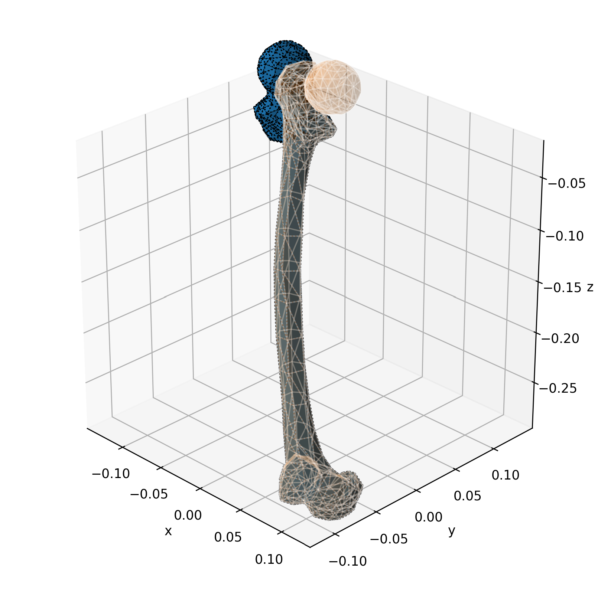
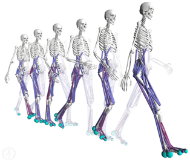
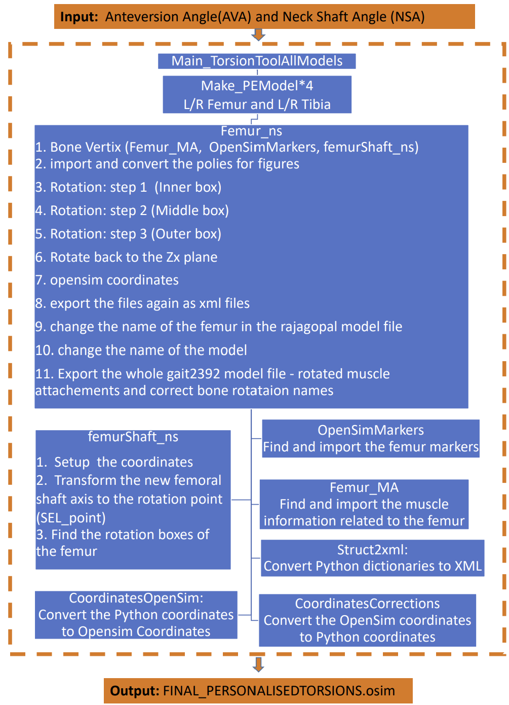
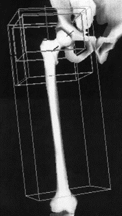
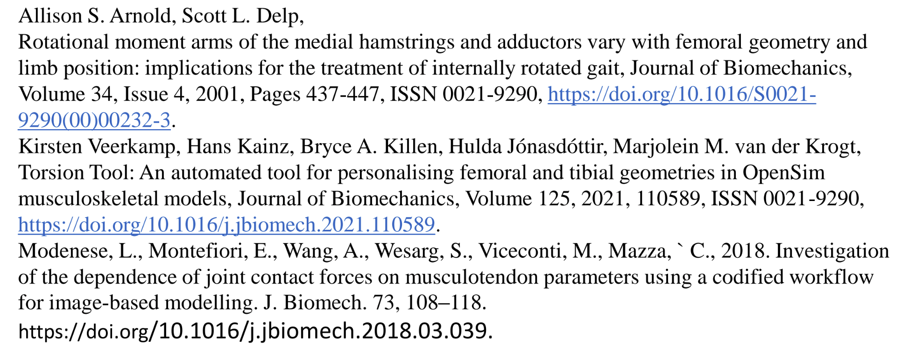

# Torsion_Tool_Python

Torsion_Tool_Python is a Python-based program that generates subject-specific musculoskeletal OpenSim models. The program requires two input angles, the Neck Shaft Angle(NSA) and the Anteversion Angle(AVA), which can be measured from the patient's CT scan.

## Why Musculoskeletal Models?

  

Subject-specific musculoskeletal (SSMS) models provide an accurate way to evaluate human movements that is non-invasive and ethical. In a study that investigates patients with motor disabilities such as Cerebral Palsy, the gait analysis of the SSMS determined the patient’s excessive internally rotated gaited is mainly caused by his abnormally anteverted femur, not by the short hamstrings and adductors that the researchers previously assumed (Delp et al., 2002). In such studies, the subject-specific musculoskeletal models are generated from magnetic resonance imaging (MRI) and/or Computed Tomography (CT) Scans (Veerkamp et al., 2021).  The developing process is time-consuming and requires a high level of expertise, which makes patient-specific studies nearly impossible for doctors to operate by 
themselves (Modenese et al., 2018). To streamline this process, the Subject-specific models can be generated by modifying a few characteristics geometries, such as the tibia torsion, femoral neck-shaft angle (NSA), and anteversion angle (AVA), of generic OpenSim (Delp et al., 1990) models. However, currently, there is no open-source tool with a free license available to generate such models. 

## What are NSA and AVA?

  

The neck shaft angle (NSA) is defined as the angle between the neck axis and the shaft axis. The anteversion angle (AVA) is the angle between the neck axis and the medial-lateral axis through the epicondyles in a plane perpendicular to the shaft axis. The NSA and AVA of the generic femur were calculated to be 123 and 17◦, respectively (Veerkamp et al., 2021). NSA and AVA are the most important aspect of the proximal femoral geometry because they have the highest impact on muscle-tendon moment arms and joint contact forces (Kainz et al,. 2020)

## Workflow of this Program

  

The diagram above demonstrates the basic workflow of the program TorsionTool_Python.Once these values are obtained from the subject’s CT scan, two rotation angles are calculated by finding the difference between the subject’s AVA and NSA angles and the generic model’s AVA and NSA angles (Offset Method). After that, the 
generic bone is sectioned into three parts (shown in 
the figure below) and the transformation will 
be performed separately. The vertices in the inner box
rotate first through an offset angle corresponding to 
the change in anteversion. Then the middlebox rotates 
through an angle that is decreased linearly as a 
function of superior-inferior distance along the axis. 
In the final step, the outer box that contains the entire 
femur is translated to restore the position of the 
femoral head. After the program finishes running, 
A new subject-specific OpenSim model is generated 
with updated geometries.

  

 

## Installation

"python -m pip install 'git+https://github.com/Jack-Zhiyuan-Ren/Ren_Femur_Twist_Python-copy.git'"

Exclude the double quotation mark when typing in terminal

## Instructions
1. Go to Main_FemurTorsionTool.
2. Enter the AVA and NSA measured from the CT scan.

## References

  

 

